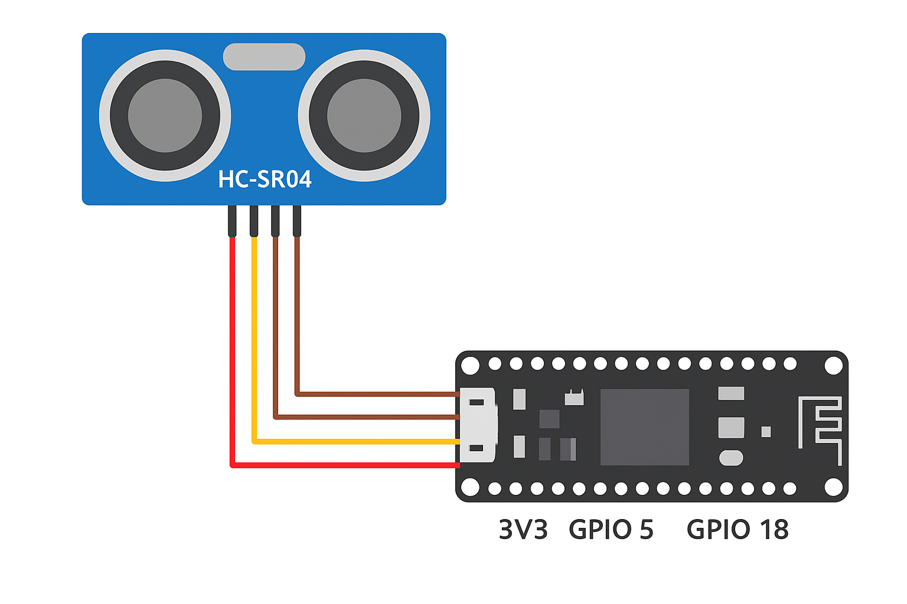

  <h2>Bill of Materials</h2>
  <ul>
    <li>ESP32 development board</li>
    <li>HC-SR04 ultrasonic sensor</li>
    <li>Raspberry Pi Zero 2 W (with Raspberry Pi OS installed)</li>
    <li>Monitor, keyboard, mouse (for Pi)</li>
    <li>Breadboard and jumper wires</li>
    <li>USB power (for ESP32 & Pi)</li>
  </ul>

<h2>Wiring (ESP32 + HC-SR04)</h2>
<ul>
  <li>VCC (HC-SR04) &rarr; 5V or 3.3V depending on your module (many accept 5V)</li>
  <li>GND &rarr; GND</li>
  <li>TRIG &rarr; GPIO 5</li>
  <li>ECHO &rarr; GPIO 18 <em>(use voltage divider if ECHO is 5V!)</em></li>
</ul>

  
  <small class="d-block text-muted">ESP32 & HC-SR04 wiring diagram</small>

  <strong>Networking tip:</strong> Both the ESP32 and Raspberry Pi must be on <b>the same local WiFi network</b> for MQTT to work.

MQTT broker runs on Raspberry Pi. In the code we use MQTT broker address <code>192.168.1.100</code> (change in <code>display_controller.py</code> if IP differs).

---

## Raspberry Pi — software steps

  <button class="btn btn-sm btn-outline-secondary copy-btn" onclick="navigator.clipboard.writeText(this.nextElementSibling.textContent)">Copy</button>
  <pre><code>sudo apt update && sudo apt upgrade -y
sudo apt install -y mosquitto mosquitto-clients python3-pip
</code></pre>

Next, install Python packages:

  <button class="btn btn-sm btn-outline-secondary copy-btn" onclick="navigator.clipboard.writeText(this.nextElementSibling.textContent)">Copy</button>
  <pre><code>python3 -m pip install paho-mqtt pygame
</code></pre>

Optional: enable autostart for mosquitto (usually starts automatically). Verify with:

  <button class="btn btn-sm btn-outline-secondary copy-btn" onclick="navigator.clipboard.writeText(this.nextElementSibling.textContent)">Copy</button>
  <pre><code>systemctl status mosquitto
</code></pre>

---

## ESP32 — software steps

<ol>
  <li>Install Arduino IDE (or use PlatformIO).</li>
  <li>Add ESP32 board support and install <code>PubSubClient</code> library.</li>
  <li>Open <code>code/esp32/distance_sender.ino</code>, fill in your WiFi SSID & password, and upload.</li>
</ol>
